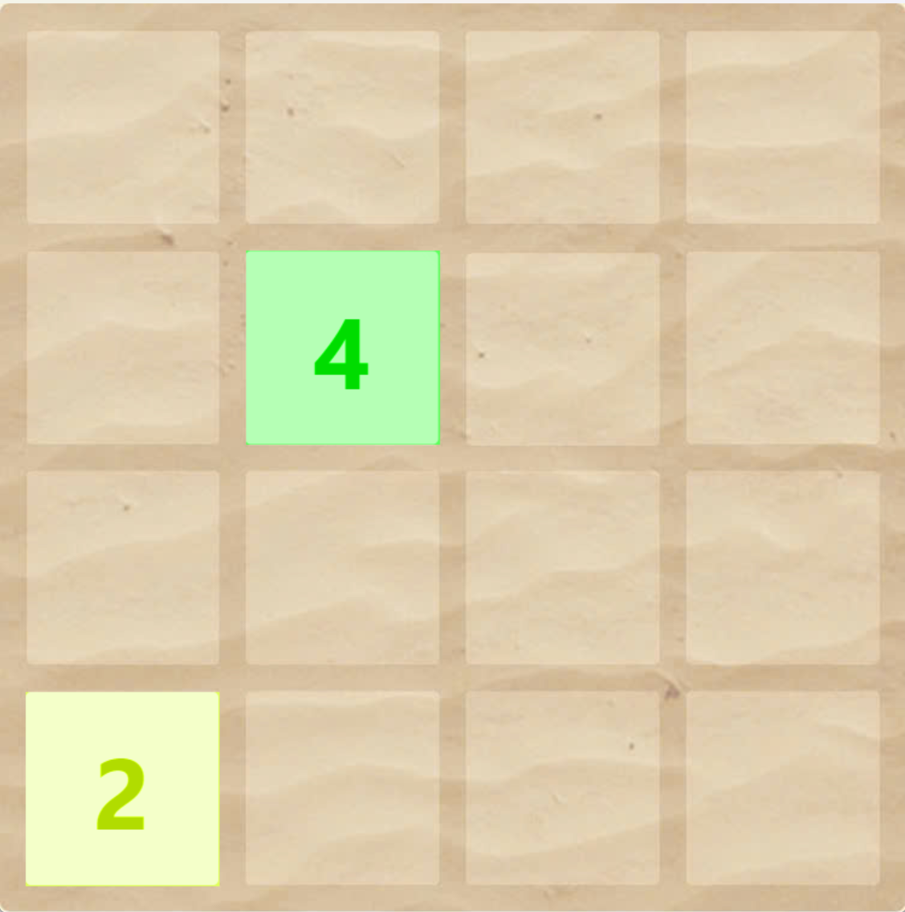
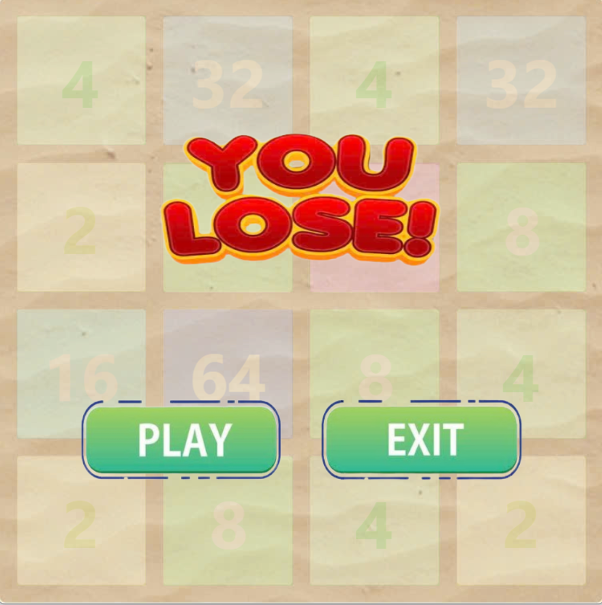
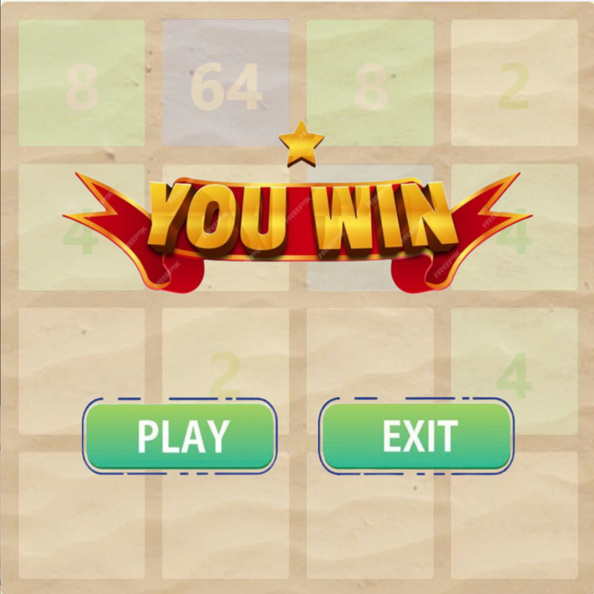

🎮 2048 Game (SDL2 Version)
2048 là trò chơi giải đố nổi tiếng, nơi người chơi trượt các ô số trên lưới để hợp nhất chúng thành ô 2048. Đây là phiên bản được phát triển bằng C++ và SDL2, với giao diện đồ họa mượt mà và hỗ trợ âm thanh, lưu điểm cao.

🧩 Tính năng
Giao diện đồ họa sử dụng SDL2

Âm thanh khi di chuyển và hợp nhất ô

Hiển thị điểm hiện tại và điểm cao nhất

Tự động lưu điểm cao sau mỗi lần chơi

Hỗ trợ các phím tắt: ⬆️⬇️⬅️➡️ để di chuyển

📷 Hình ảnh minh họa

▶️ Cách chơi
Sử dụng các phím mũi tên để di chuyển các ô.

Khi hai ô có cùng giá trị va chạm, chúng sẽ hợp lại.

Mục tiêu: tạo ra ô số 2048!
